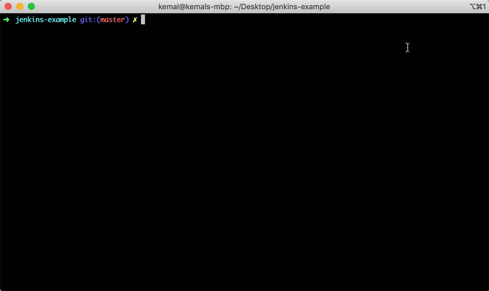
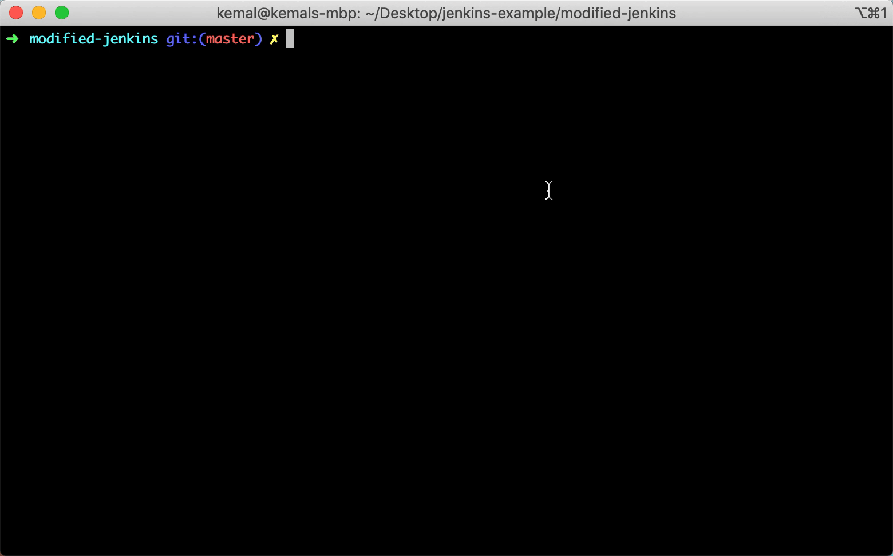
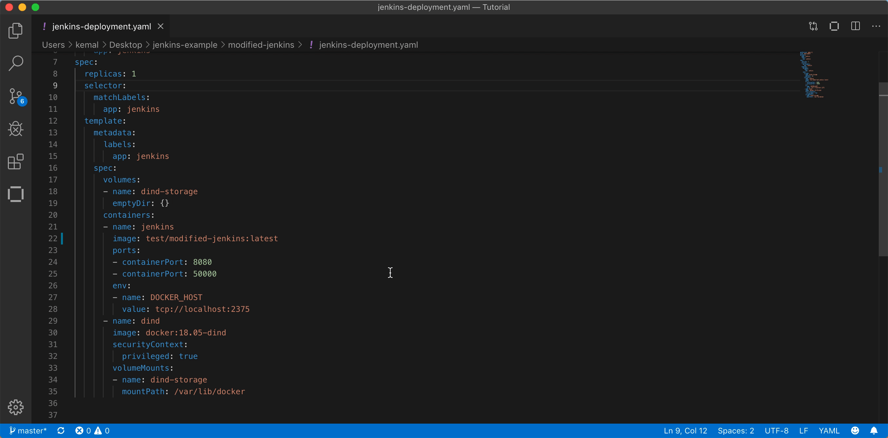
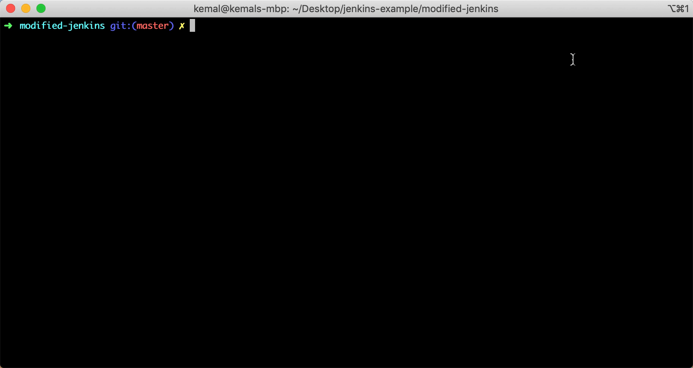
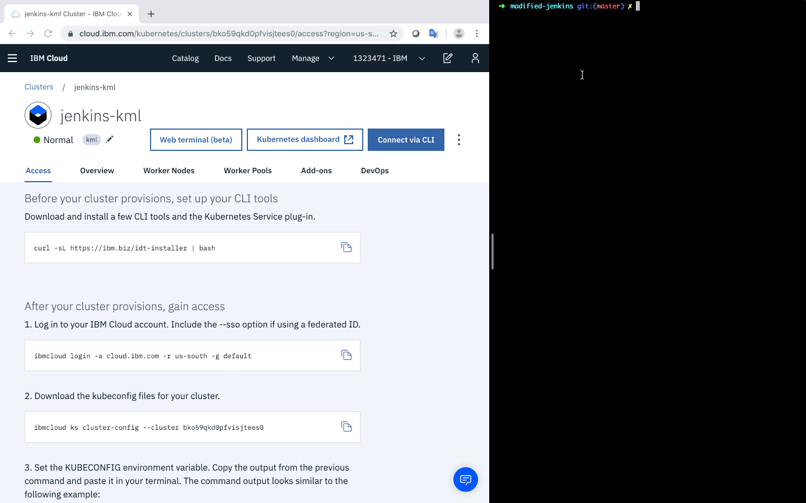
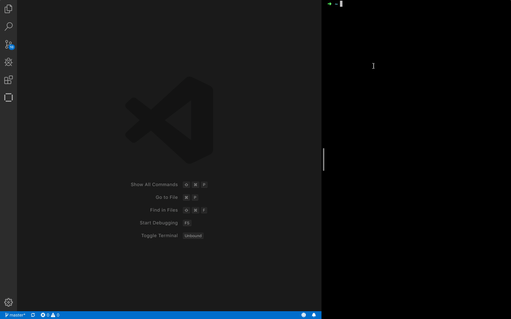
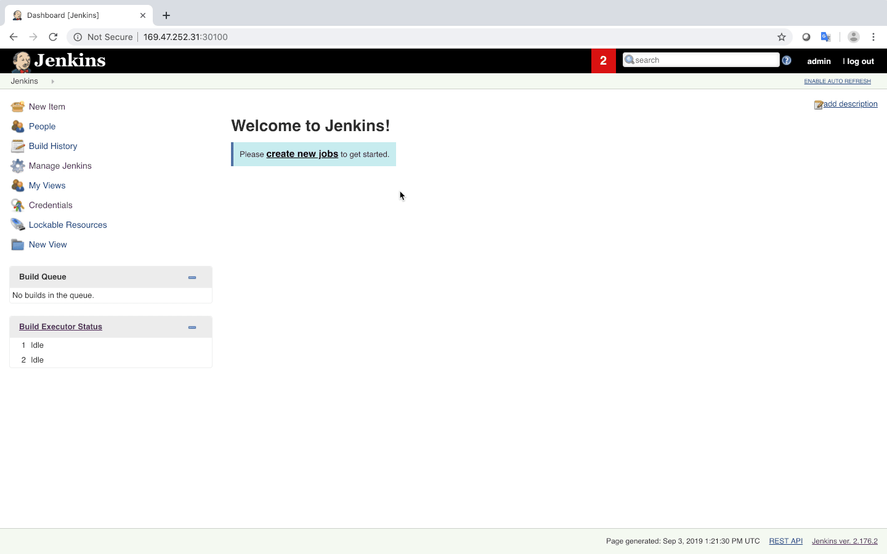
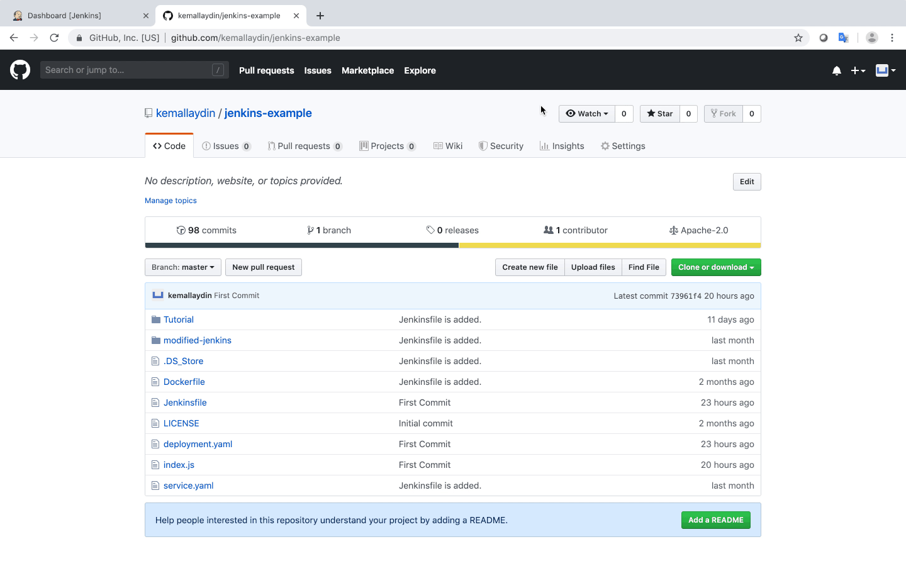

# Configuring CI/CD on Kubernetes with Jenkins

### Introduction

DevOps encourages collaboration, cooperation, and communication between developers and operations teams to improve the speed and quality of software development. One of the key principles of DevOps is automation, which reduces human error, provides consistent results, and even mitigates risks. With the help of automation, you and your team can build, test, and deploy software quickly and efficiently. 

In this tutorial, you’ll learn how to achieve a fully automated environment with Jenkins on Kubernetes.

### Learning objectives

In this tutorial, you will:  

* Set up a Jenkins environment on Kubernetes
* Configure a CI/CD Jenkins pipeline
* Build Docker images using Jenkins 
* Push Docker images to a Docker registry
* Deploy Docker images to a Kubernetes environment
* Integrate Slack and Jenkins
* Integrate GitHub and Jenkins using GitHub webhooks

## Prerequisites

* Create a free [IBM Cloud Account](https://cloud.ibm.com)
* Install the [IBM Cloud CLI](https://cloud.ibm.com/docs/cli?topic=cloud-cli-install-ibmcloud-cli)
* Download and install [Docker](https://www.docker.com/)
* Create a [Docker Hub Account](https://hub.docker.com)
* Install the [Kubernetes CLI(kubectl)](https://kubernetes.io/docs/tasks/tools/install-kubectl/)
* Install a [Git Client](https://git-scm.com/downloads)
* Create a [GitHub Account](https://github.com)
* Create a [Slack Account](https://slack.com)

> **(Optional) Note:** Open up a terminal and run the following command to install the IBM Cloud CLI and Developer Tools, which include IBM Cloud CLI, Kubernetes CLI (kubectl), Docker CLI, and Git CLI. 

```
$ curl -sL https://ibm.biz/idt-installer | bash
```

Before we begin creating, building, and deploying, let’s first understand some of the tools and software we'll be using throughout this tutorial.

### What is Jenkins?

Jenkins is an open source automation server that you can use to automate tasks related to software development, testing, or deployments. 

### What is Docker?

Docker is an open source software platform built to make it easier to create, deploy, and run applications using containers. A container is a standardized package of software, which can include libraries and other dependencies. 

### What is Kubernetes?

Kubernetes is an open source container orchestration platform for automating deployment and scaling and managing containerized workloads and services. 

Now we’re ready to get started. 

## Steps

Follow these steps to setup and run this tutorial.

1. [Create a Kubernetes Cluster on IBM Cloud](#1-create-a-kubernetes-cluster-on-ibm-cloud)
2. [Build a Modified Jenkins Image](#2-build-a-modified-jenkins-image)
3. [Deploy a Modified Jenkins Image to Kubernetes](#3-deploy-a-modified-jenkins-image-to-kubernetes)
4. [Set up Jenkins Environment](#4-set-up-jenkins-environment)
5. [Create the First Jenkins Pipeline](#5-create-the-first-jenkins-pipeline)
6. [Integrate Jenkins and Slack](#6-integrate-jenkins-and-slack)
7. [Integrate Jenkins and GitHub](#7-integrate-jenkins-and-github)
8. [Test the First Jenkins Pipeline](#8-test-the-first-jenkins-pipeline)

### 1. Create a Kubernetes Cluster on IBM Cloud

Login to IBM Cloud and choose the `'Kubernetes'` option from the navigation menu. Then, click on the `'Create Cluster'` button and select the `'Free'` plan. 

>**Note:** This process will take approximately 40 minutes.


### 2. Build a Modified Jenkins Image

Early on, Jenkins was designed to run on physical machines without any containerization technology. As containerization become more popular, Jenkins adapted its solution to the new containerized world. Unfortunately, this change brought some challenges. For instance, Jenkins requires Docker to build Docker images. However, a containerized version of Jenkins does not contain Docker and Docker CLI by default. For this reason, a new Docker image that contains Docker CLI and other tools must be created by using a Jenkins image as a base image.

Docker uses `'Dockerfile'` to build custom images. For further information please see: [Dockerfile reference](https://docs.docker.com/engine/reference/builder/)

In `'modified-jenkins'` directory there is a `'Dockerfile'` to build custom `'Mofidied Jenkins Image'`.

Let's see how it looks like!

```
FROM jenkins/jenkins:lts

USER root

ENV DOCKERVERSION=18.03.1-ce

RUN curl -fsSLO https://download.docker.com/linux/static/stable/x86_64/docker-${DOCKERVERSION}.tgz \
  && tar xzvf docker-${DOCKERVERSION}.tgz --strip 1 \
                 -C /usr/local/bin docker/docker \
  && rm docker-${DOCKERVERSION}.tgz

RUN curl -LO https://storage.googleapis.com/kubernetes-release/release/$(curl -s https://storage.googleapis.com/kubernetes-release/release/stable.txt)/bin/linux/amd64/kubectl \
	&& chmod +x ./kubectl \
	&& mv ./kubectl /usr/local/bin/kubectl
```

Let's examine the steps one by one.

```
FROM jenkins/jenkins:lts
```

* This step specifies the base image.

```
USER root
```

* This step grants root access to image. Root access will be used while installing the Docker CLI and Kubernetes CLI(kubectl).

```
ENV DOCKERVERSION=18.03.1-ce
```

* This step sets an environment variable.

```
RUN curl -fsSLO https://download.docker.com/linux/static/stable/x86_64/docker-${DOCKERVERSION}.tgz \
  && tar xzvf docker-${DOCKERVERSION}.tgz --strip 1 \
                 -C /usr/local/bin docker/docker \
  && rm docker-${DOCKERVERSION}.tgz
```

* This step downloads Docker, installs the Docker CLI and removes the Docker Daemon.

>**Note:** The mofidied Jenkins image does not contain Docker Daemon. Docker Daemon will run in another container. Modified Jenkins image will refer to that Docker Daemon container. (See: [Docker in Docker](https://hub.docker.com/_/docker))

```
RUN curl -LO https://storage.googleapis.com/kubernetes-release/release/$(curl -s https://storage.googleapis.com/kubernetes-release/release/stable.txt)/bin/linux/amd64/kubectl \
	&& chmod +x ./kubectl \
	&& mv ./kubectl /usr/local/bin/kubectl
```

* This step downloads the Kubernetes CLI(kubectl) and installs it.

Docker reads the steps one by one and builds customized image. Let's see how Docker builds custom images.

* Next, open a terminal and navigate to the `'modified-jenkins'` directory.

```
cd modified-jenkins
```

* Replace `'kmlaydin'` with your Docker Hub username and run the following command to build a modified Jenkins image:

```
docker build -t kmlaydin/modified-jenkins:latest .
```



Congratulations! The modified Jenkins image was successfully built.

### 3. Deploy a Modified Jenkins Image to Kubernetes

The modified Jenkins image is in the local environment now and Kubernetes cannot access the local images. This is where Docker Hub comes into the picture. Docker Hub is a cloud-based repository in which Docker users and partners create, test, store, and distribute container images. A modified Jenkins image is needed to push to the Docker Hub or other container registries like [IBM Cloud Container Registry](https://www.ibm.com/cloud/container-registry). By default, Docker uses Docker Hub.

* First, start by running the following command to login to Docker Hub via the terminal:

```
docker login
```

* Next, push the modified Jenkins image to Docker Hub with this command (remember to replace `'kmlaydin'` with your Docker Hub username):

```
docker push kmlaydin/modified-jenkins:latest
```



The pushed image can now be seen via [Docker Hub](https://hub.docker.com/) and Kubernetes can now access the image conveniently. Kubernetes works with [YAML files](https://developer.ibm.com/tutorials/yaml-basics-and-usage-in-kubernetes) to handle configurations.

* Now you need to open the `'jenkins-deployment.yaml'` file, located in the `'modified-jenkins directory'`, with a code editor.
* Find `'kmlaydin/modified-jenkins:latest'` and replace the Docker Hub username, pushed image's name, and version.



The deployment file is now ready to deploy modified Jenkins to Kubernetes.

* Now, open the Kubernetes cluster dashboard which we created in step 1. Navigate to the `'Access'` tab and run the commands to gain access to the Kubernetes cluster via the terminal.


* Make sure that the directory is `'modified-jenkins'` and run the following commands to deploy the modified Jenkins to Kubernetes:

```
kubectl apply -f jenkins-deployment.yaml
```
```
kubectl apply -f jenkins-service.yaml
```

* Now run the following command to make sure that Jenkins is deployed and has a running status. The deployment process may take a couple of minutes.

```
kubectl get deployment,pod,service
```



* Run the following commands to retrieve the external IP of your worker node to gain access to the Jenkins dashboard:

```
$ export EXTERNAL_IP=$(kubectl get nodes -o jsonpath='{.items[0].status.addresses[?(@.type=="ExternalIP")].address }')
```

```
$ export NODE_PORT=30100
```

```
$ echo $EXTERNAL_IP:$NODE_PORT
```



### 4. Set up Jenkins Environment

Now it’s time to set up your Jenkins environment. Jenkins assigns the initial admin password, which can be found by logging the Jenkins container.

* Run the following command to obtain the logs of the Jenkins container:

```
kubectl logs $(kubectl get pods --selector=app=jenkins -o=jsonpath='{.items[0].metadata.name}') jenkins
```
>**Note:** The initial admin password can be found between the rows of asterisks.

Now select the `'Install suggested plugins'` option. Continue by selecting `'Continue as admin'` and then click the `'Save and Finish'` button.

And just like that, Jenkins is ready to use.


With Jenkins ready for use, the following credentials are needed for Jenkins to fulfill a duty conveniently and to run properly:

* `'GitHub'` credentials to gain access to source code
* `'DockerHub'` credentials to push a built image to Docker Hub
* `'Kubeconfig'` file to gain access to a Kubernetes cluster

`'GitHub'` and `'DockerHub'` credentials are type of `'Username with password'`. But `'Kubeconfig'` credential is type of `'Secret file'`. Remember in step 3, you downloaded the Kubeconfig file and it was exported as an environment variable to your local computer.

Now you need to go to the Kubeconfig directory of the Kubernetes cluster (the Kubeconfig environment variable should be set before running this command):
```
$ cd $(echo $KUBECONFIG | awk '{split($0,a,"kube-config"); print a[1];}') && ls
```
There should be two files in the directory.

* `'<PEM-FILE>.pem'` file that stands for Privacy-Enhanced Mail and is a file format for storing and sending cryptographic keys, certificates, and other data.

* `'<KUBE-CONFIG>.yml'` file is used to configure access to a cluster and sometimes is called a kubeconfig file, which is a generic way of referring to configuration files.

Both files should be in the same directory. In Jenkins, there is no option to keep these two files in the same directory. For this reason, the `'<PEM-FILE>.pem'` file should be embedded into the `'<KUBE-CONFIG>.yml'`file. To do this, copy both files in to the desktop directory. The copying process is not obligatory but is done to preserve the original files. 

Now run this command in the directory that contains the `'<PEM-FILE>.pem'` file and the `'<KUBE-CONFIG>.yml'` file.

```
$ for file in ./*; do cp $file /Users/$USER/Desktop; done;
```

* If you’d like, the destination directory can be changed by editing `'/Users/$USER/Desktop'`.

Next, go to the desktop directory via the terminal. Encode the `'<PEM-FILE>.pem'` file as base64:

```
$ base64 <PEM-FILE>.pem
```

Copy the result and open the `'<KUBE-CONFIG>.yml'` file with a code editor. Find `'certificate-authority: <PEM-FILE>.pem'` and change it to `'certificate-authority-data: <BASE64-RESULT>'`.



After completing the steps above, the `'<KUBE-CONFIG>.yml'` now contains the `'<PEM-FILE>.pem'` file.

Now go back to the Jenkins dashboard and find the `'Credentials'` option in the left pane and select the `'(global)'` option. The credentials can be added by clicking the `'Add Credentials'` button in the left pane. First, add the `'GitHub'` credentials as `'Username with password'` with the ID `'github'`. Then add the `'DockerHub'` credentials as `'Username with password'` with the ID `'dockerhub'`. Lastly, add the `'Kubeconfig'` credentials as `'Secret file'` with the ID `'kubeconfig'`.

The credentials are now ready to use and now plugins need to be installed. Jenkins has a wide range of plugin options. The [Kubernetes CLI](https://plugins.jenkins.io/kubernetes-cli) plugin is not mandatory; however, it eases the process. Kubernetes CLI allows you to configure `'kubectl'` to interact with Kubernetes clusters.

Let’s get that set up by going back to the Jenkins dashboard and finding the `'Manage Jenkins'` option in the left pane. Select `'Manage Plugins'` and then choose the `'Available'` tab. There should be a lot of available plugins in that tab. Search for the `'Kubernetes CLI'` plugin and install it. Hooray, Jenkins is ready for the first landing!

### 5. Create the First Jenkins Pipeline

To create the first Jenkins pipeline, a GitHub account that contains example files is needed. Example files can be `'deployment.yaml'`, `'Dockerfile'`, `'index.js'`, `'Jenkinsfile'` or `'service.yaml'`.

Navigate back to the Jenkins dashboard and find the `'New Item'` option in the left pane. Enter an item name and choose `'Pipeline'`. (An example project URL is `'https://github.com/kemallaydin/jenkins-example'`)

Choose `'GitHub project'` and type your project’s URL. Find the `'Pipeline'` section and change the definition value from `'Pipeline script'` to `'Pipeline script from SCM'`. For the `'SCM'` option, choose `'Git'`.

Now type in your repository URL and choose the `'Github'` credentials. (An example repository url is `'https://github.com/kemallaydin/jenkins-example.git'`)



Great! You’re now ready for the next step.

### 6. Integrate Jenkins and Slack

To post notifications to a Slack channel, Jenkins needs the `'Slack Plugin'`. Go back to the Jenkins dashboard and find the `'Manage Jenkins'` option in the left pane. Select the `'Manage Plugins'` option and choose the `'Available'` tab. Search for the `'Slack Notification'` plugin and install it.

Hopefully you’ve already created your Slack account. If not, [click here](https://slack.com/) to get started. Once you have a Slack account, configure the Jenkins integration by using [Jenkins CI](https://my.slack.com/services/new/jenkins-ci). After configuration, click on `'Manage Jenkins'` again in the left navigation and go to `'Configure System'`. Find the `'Slack'` section and add the following values:

* **`Workspace`**: \<TEAM-SUBDOMAIN>
* **`Credential`**: \<INTEGRATION-TOKEN-CREDENTIAL-ID>
* **`Default channel / member id`**: \<CHANNEL-NAME>

If you’d like, you can create a secret text credential by clicking the `'Add'` button. You can also test the Jenkins and Slack integration by clicking the `'Test Connection'` button.


### 7. Integrate Jenkins and GitHub

To receive specified events to Jenkins from GitHub, you need to configure [Webhooks](https://developer.github.com/webhooks/). Webhooks allow external services to be notified when certain events happen. When the specified events happen, GitHub will send a POST request to Jenkins. 

To begin configuration, navigate to your project repository on GitHub. Click `Settings` in the right corner and find the Webhooks option in the left pane. Click the `Add webhook` button. The payload URL is `http://<JENKINS-URL>:<JENKINS-PORT>/github-webhook/`. An example URL looks like
`http://169.47.252.31:30100/github-webhook/`. Make sure you save the webhook. 

Jenkins is now configured to accept events from GitHub and there’s only a few more steps to complete the Jenkins and GitHub integration.

Head over to the first pipeline's dashboard and click the `'Configure'` option. Choose `'GitHub hook trigger for GITScm polling'` under the `'Build Triggers'` section and save the configuration. The pipeline should be triggered manually once to identify stages which are used in the Jenkinsfile. After that, the GitHub webhook can trigger the pipeline.

>**Note:** <u>Pipeline should be triggered manually once</u> to be identified Jenkinsfile steps by Jenkins. After that, GitHub wekbooks can trigger the pipeline.



### 8. Test the First Jenkins Pipeline 

You’ve made it to the final step! Jenkins is finally ready to test. Go to the first pipeline's dashboard and click `'Build Now'`. The steps that are defined in Jenkinsfile are now available. Simply make a small change on the `'index.js'` and push it to `GitHub`. The pipeline is triggered by GitHub and Jenkins deploys a sample NodeJS application to Kubernetes. The application can be found at `http://<JENKINS-URL>:30300/getpodinfo`.


Lastly, run the following command to watch the changes in Kubernetes while the building process is running.

```
kubectl get pods -w
```


 >**Note:** In this demonstration, the replica size is increased from 1 to 10. To test it modify the `'deployment.yaml'`.

 ### Summary

 Congratulations! You’ve successfully set up a continuous integration environment using Jenkins, Slack, and GitHub. Integrating GitHub with Jenkins automates deployment, testing, and ensures your projects are always up to date. 